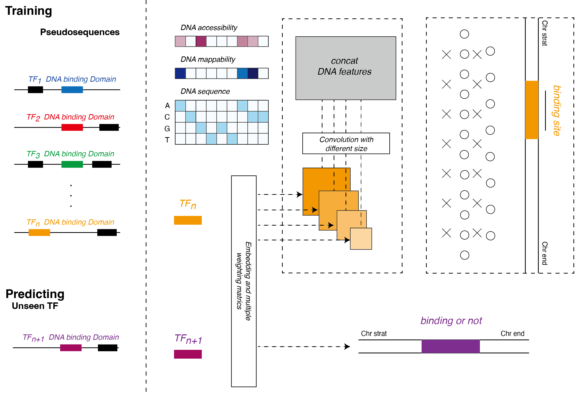

## TFNet-single

*Aim to predicting transcriptional factors binding site using pseudosequences by deep learning model.*


## Workflow




### TF pseudosequence generation

```
# cluster tfs by dbd identity 
# generate pseudosequence by cluster
# align DBD sequences by mafft
# calculate the metrics
```
all DBD sequences were collected from [cis-bp](http://cisbp.ccbr.utoronto.ca)


### Genomic sequence data

```
# Genome size of each chromosome, may need to filter some chrom in the hg19.chrom.sizes.reduced
samtools faidx data/genome/genome.fa
cut -f 1,2 data/genome/genome.fa.fai > data/hg19.chrom.sizes.reduced
```
Genomic sequence is provided as fasta format. You can download these files from [here](https://hgdownload.soe.ucsc.edu/downloads.html)
blacklist can be downloaded from [here](https://github.com/Boyle-Lab/Blacklist/blob/master/lists/)


### for preprocessing Chromatin accessibility data

```
# If you have replicates for the same cell type, you should first merge them with samtools
samtools merge -o merge.bam rep1.bam rep2.bam
samtools index merge.bam
# run the bamCoverage in deeptools to generate the required .bw file 
bamCoverage --bam merge.bam -o merge.bw -p 4 --binSize 1 --normalizeUsing RPGC --effectiveGenomeSize 2864785220 --ignoreForNormalization chrX chrM 
```
effectiveGenomeSize can be found [here](https://deeptools.readthedocs.io/en/latest/content/feature/effectiveGenomeSize.html)


### for preprocessing chip-seq data

```
# need .bed file and chip.txt contain the file and name of all tfs
# generate tf binding bed file with corresponding cell type (for specific atac signal)

python preprocess_data.py -d configure/data.yaml -m configure/tfnet.yaml
```


### for TFNet Training and Testing

```
python main.py -d configure/data.yaml -m configure/tfnet.yaml --mode train -n 5
# with large training data, split data by epoch and train
python main_epoch.py -d configure/data_grch38.yaml -m configure/tfnet.yaml --mode train -n 5

python main.py -d configure/data.yaml -m configure/tfnet.yaml --mode eval -n 5 # evaluate on test set
python main.py -d configure/data.yaml -m configure/tfnet.yaml --mode predict -n 5 # predict on independent data set

python main.py -d configure/data.yaml -m configure/tfnet.yaml --mode 5cv # 5 cross-validation
python main.py -d configure/data.yaml -m configure/tfnet.yaml --mode lomo # leave one data out cross-validation
```